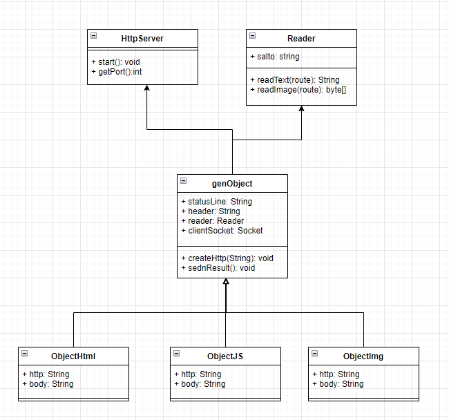

# TAREA 3 ARSW 

Escriba un servidor web que soporte multiples solicitudes seguidas (no concurrentes). El servidor debe retornar todos los archivos solicitados, incluyendo
paginas html e imagenes.
# LOC/h. Rendimiento

1. desde las 11:00 am, hasta las 12:30 pm - fueron en total 32 lineas
2. desde las 7:36 pm, hasta las 8:55 pm - fueron en total 102 lineas


LOC = (134L/2.5h)

## 53.6 LOC

# Documentación

La documentacion de este proyecto esta en la siguiente ruta del proyecto:
```
raiz /README.md
```
## EMPEZAR

Copie el proyecto via git clone en cualquier diretorio para empezar a trabajar:
```
git clone https://github.com/MatiwsxD/arsw-i-Lab03.git
```

### Prerequisitos

Tener instalado Java jdk versiones 7+, Maven comandos y git

### Instalando

1. Ejecutar en terminal:

```
$$ mvn clean install
```
2.(opcional):
si requiere la documentacion del codigo ejecute y estara en raiz /target:

```
mvn javadoc:javadoc
```

2. (Demostracion):
   compile el proyecto desde la carpeta raiz ejecutando la siguiente linea dependendiendo del metodo de lectura si es 'loc' o 'phy' y poniendo la ruta del archivo a analizar (recuerde que esto entra como parametro)

```
java -cp ".\target\classes" edu.escuelaing.arsw.app.App loc D:\Escritorio\arsw-i-Lab01\Test\Test1.java

```
3. Para Obtener la imagen escriba en su navegador:
```
   http://localhost:36000/ImgPrueba.jpg
```
4. Para obtener el html guardado en el servidor escriba:

```
   http://localhost:36000/resultado.html
```

5. Para obtener el codigo en JavaScript escriba:

```
   http://localhost:36000/File.js
```

6. Diagrama de clases
   


## Built con

* [Maven](https://maven.apache.org/) - Dependency Management
* [JAVA JDK 8](http://www.oracle.com/technetwork/java/javase/overview/index.html) - construcción


## Autor

* **Juan Mateo Mejia Zuluaga** - *Initial work* - [MatiwsxD](https://github.com/MatiwsxD)


## Licencia

This project is licensed under the GNU General Public License - see the [LICENSE](LICENSE) file for details
